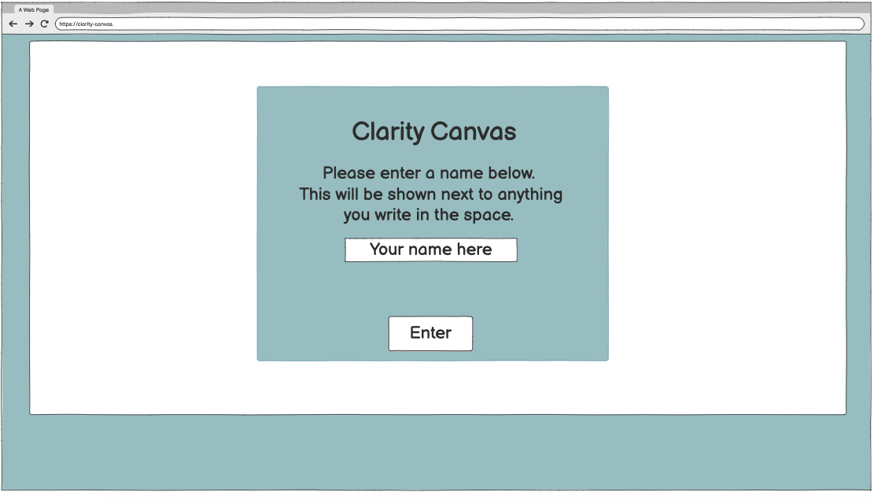
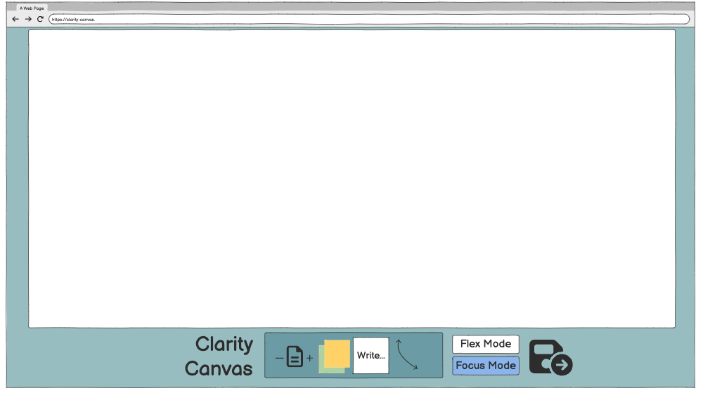
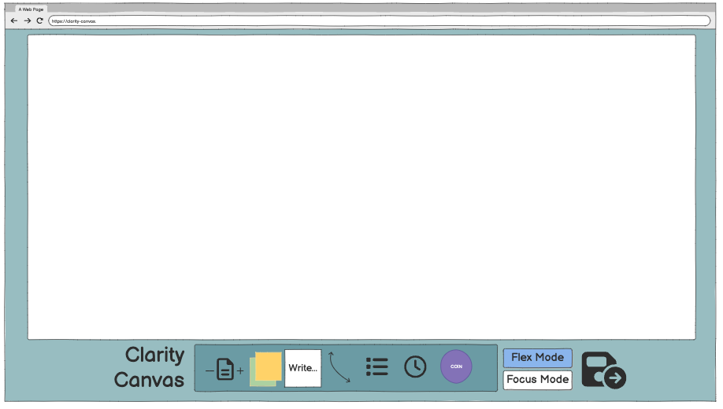
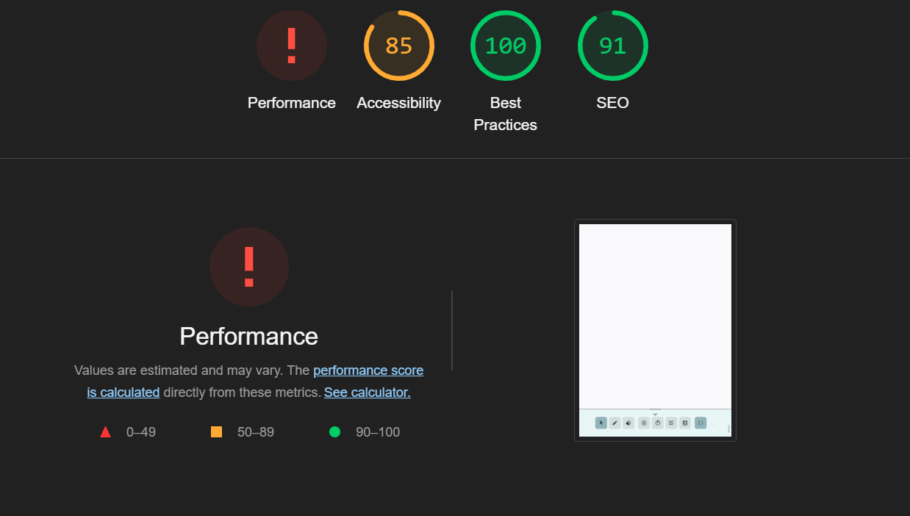
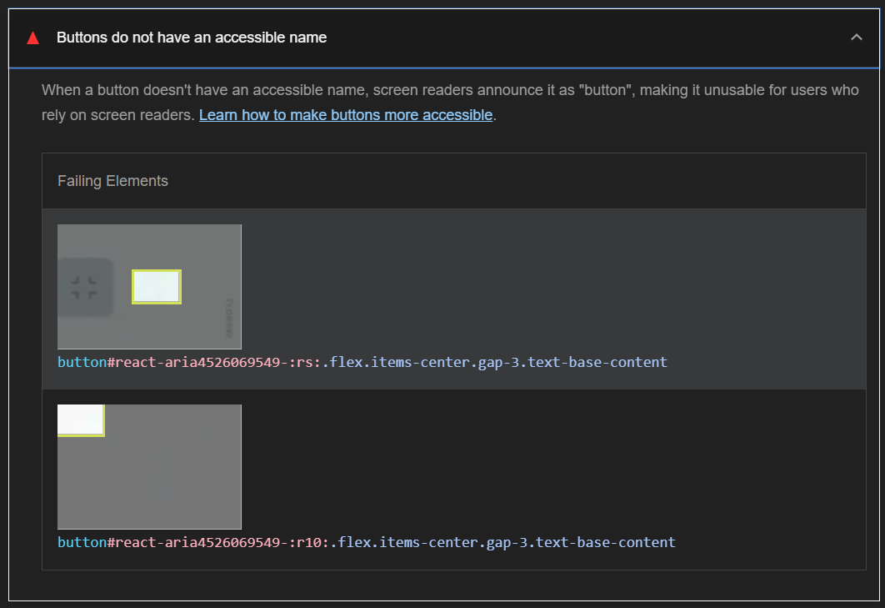
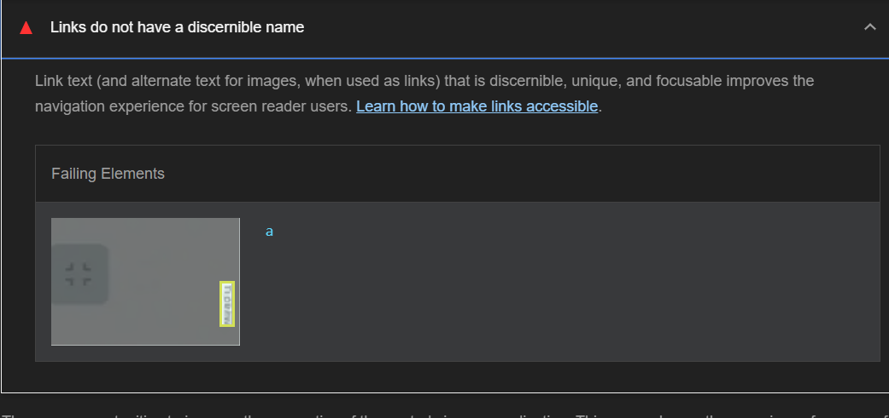

# Clarity Canvas

Deployed at: https://andreamaestri.github.io/Clarity-Canvas/

## Contents

- [Project Overview](#project-overview)
- [Features](#features)
- [Technologies Used](#technologies-used)
- [User Stories](#user-stories)
- [Acceptance Criteria](#acceptance-criteria)
- [Design](#design)
- [Testing](#testing)
- [Deployment](#deployment)
- [Reflection](#reflection)
- [Credits](#credits)

## Project Overview

This project was developed during a hackathon hosted by [Code Institute in November 2024](https://hackathon.codeinstitute.net/hackathon/53/). The goal was to come up with an idea for an app which helps people with accessibility needs. We were allowed to use any technology that we felt was necessary.

Our project, **Clarity Canvas**, is an online whiteboard intended for collaborative work. It offers a simplified digital workspace that optimises focus, with features for time management and organization. Our project was aimed at neurodivergent users who would benefit from being able to manage how stimulating their online work environment was.

## Features

- **Initial Setup**: When entering the work space, the user is welcomed with a popup window that prompts them to close what is the initial setup that they would like to use:

  - They first must enter there name so that could be displayed with their contributions;
  - Mode Selection: _Flex mode_ has all the tools available for choosing while _Focus mode_ does not offer widget selection. Focus mode is pre-selected;
  - Colour scheme: 3 options for colors in the app will be given to the user to choose from based on their mode selection;
  - Widgets selection: The user that choose the flex mode will have some widgets to choose from.

    - White background noise for focusing purposes.

- **Coin flip**: To help the user with decision making;
- **Timer**: To help the user take constant breaks;
- **Todo List**: To help the user managing their tasks;
- **White noise**: Background calming noises to help the user focus;
- **Post-it**: To interact with other the user can drag and drop a post-it style square where they can write in it;
- **Color palette**: Three options per mode are given to the user:
  - Flex mode offers a more vibrant colour palette;
  - Focus mode offers a more washed out colour palette.

## Technologies Used

- **HTML**: Used for creating the initial popup window.
- **JavaScript**: Used for connecting and making the initial popup window responsive.
- **CSS**: For styling the page.
- **React**: Creating and incorporating widgets and tools for the page.
- **TLDraw**: Library used as the base for the project.
- **[Additional Technologies]**: [Brief explanation of how they were used]

## User Stories

#### **Setup and Customisation User Stories**

- **As a new user**, I want to be prompted with an initial setup screen, so that I can quickly customise my workspace with options like font size, mode selection (focus or normal), and colour scheme.
- **As a user**, I want to choose between two modes: “Focus Mode” (low stimulation) and “Normal Mode” (high-medium stimulation), so that the workspace environment can match my current focus needs.
- **As a user**, I want to select a colour scheme from an accessible palette, so that my contributions are visually distinct and the interface is comfortable for my eyes.
- **As a user**, I want to customise the initial set of widgets available on my workspace, so that I can start with tools that best support my focus and productivity.

#### **Central Whiteboard User Stories**

- **As a user**, I want a central whiteboard space that fills most of the screen, so that I can focus on my work without unnecessary distractions.
- **As a user**, I want each participant’s contributions to be colour-coded, so that I can easily identify who added what content.
- **As a user**, I want a simple and uncluttered layout with all widgets and tools in one panel, so that I can access what I need quickly without feeling overwhelmed.

#### **Focus and Stimulation Mode Features**

- **As a user in Focus Mode**, I want a simplified, minimal interface with muted colours, so that I can maintain concentration without overstimulation.
- **As a user in Normal Mode**, I want to access additional features like white noise generation (office sounds, rain, etc.), so that I can create a background environment that helps me stay engaged.
- **As a user**, I want to easily switch between Focus Mode and Normal Mode, so that I can adapt my workspace based on my current focus needs.

#### **Widget Features**

- **As a user**, I want a Pomodoro timer widget, so that I can work in focused intervals with automatic break reminders.
- **As a user**, I want an optional basic timer widget, so that I can set custom intervals and reminders for breaks.
- **As a user**, I want a Yes/No coin flipper widget, so that I can make quick decisions without overthinking.
- **As a user**, I want a simple task-tracker/prioritiser widget, so that I can keep track of my tasks and focus on priorities.
- **As a user**, I want a sticky notes widget, so that I can jot down quick ideas or reminders without leaving the whiteboard space.
- **As a user**, I want a customisable focus timer with adjustable intervals, so that I can set work and break periods that match my preferred productivity rhythm.

#### **Collaboration Features**

- **As a user**, I want to receive subtle notifications when a collaborator adds content, so that I stay informed about changes without losing focus.
- **As a user**, I want to see a session summary at the end of each collaboration, so that I can review the main points and contributions made during the session.
- **As a user**, I want each collaborator’s contributions to be marked with their assigned colour, so that I can easily distinguish between users’ inputs.

#### **Accessibility and Ease of Use Features**

- **As a user**, I want to be able to dock, rearrange, or hide widgets in my workspace, so that I can organise my tools in a way that feels intuitive and reduces visual clutter.
- **As a user**, I want an auto-save feature that stores my work and a restore option when I return, so that I don’t lose progress if I get distracted or need to step away.
- **As a user**, I want to enable optional audio or visual cues for reminders to refocus, so that I can stay on task with gentle prompts.
- **As a user**, I want keyboard accessibility for key features (e.g., starting the timer, toggling focus mode, submitting tasks), so that I can easily navigate and interact with the app without needing a mouse.

#### **MVP (Minimum Viable Product) Features**

- **As a user**, I want a basic central whiteboard with real-time updates and colour-coded contributions, so that I can collaborate with others effectively from the start.
- **As a user**, I want a settings screen with options for font size, mode selection, and colour scheme, so that I can adjust the interface to my preferences quickly.
- **As a user**, I want a toggle button for Focus Mode, so that I can simplify the UI instantly when I need to concentrate.
- **As a user**, I want to have at least a basic timer widget for managing break times, so that I can incorporate regular breaks into my workflow.

#### **Stretch Features (Optional Add-ons for Future Iterations)**

- **As a user**, I want to integrate third-party tools like Google Calendar or Notion, so that I can synchronise my tasks and schedule with external productivity apps.
- **As a user**, I want to have an “Attention Booster” widget that offers quick motivational prompts or tips, so that I can regain focus when I start feeling distracted.
- **As a user**, I want to have access to a history log of all changes made on the whiteboard, so that I can review edits and contributions made over time.

## Acceptance Criteria

### Must Haves

- **Initial Setup Popup**: A fully functional popup window that appears when the user enters the workspace, allowing them to input their name, select a mode, choose a colour scheme, and configure initial widgets.
- **Focus Mode**: A simplified, distraction-free workspace with muted colours and pre-selected widgets aimed at enhancing focus.
- **Basic Widgets**: Essential widgets such as a timer, white noise generator, and a basic to-do list must be included to support core functionality.
- **Real-Time Whiteboard**: A collaborative whiteboard with real-time updates and colour-coded contributions to distinguish between users.

### Should Haves

- **Flexible Workspace**: The ability for users to dock, rearrange, or hide widgets to personalise their workspace.
- **Switching Modes**: A toggle button to seamlessly switch between Focus Mode and Flex Mode based on user needs.
- **Collaborator Identification**: Subtle visual cues and colour coding to identify contributions from different collaborators.
- **Customisable Timer**: A Pomodoro-style timer with adjustable intervals for work and break periods.

### Could Haves

- **Attention Booster Widget**: Quick motivational prompts or tips to help users refocus during sessions.
- **Expanded White Noise Options**: Additional sounds like nature noises, office ambiance, or custom uploads.
- **History Log**: A version history or change log for reviewing edits and contributions made over time.
- **Advanced Accessibility Features**: Optional audio or visual cues for reminders and enhanced keyboard navigation.

## Design

### Wireframes

- The initial popup idea was simpler than the one implemented;
  
- Focus mode window;
  
  -Flex mode window;
  

### Color Palette

- All the six colour palettes were chosen to provide the user with options to improve productivity and focus given that our focus group is people with ADHD. So the user can choose to have more or less vibrant color schemes, more colours or only black and white.

### Typography

**Sans-Serif (Default/System Font)**

- Headers: Clean and modern, ensuring attention-grabbing readability.
- Body Text: Ideal for digital legibility and simplicity.

## Testing

### Tools Used

- Lighthouse

### Lighthouse testing

The project was tested through Lighthouse, and scored the following:
Performance: 0-49 (Improvement needed)
Accessibility: 85 (Improvement needed)
Best Practices: 100;
Seo: 91


Accessibility scores in Lighthouse were low due to the following:

1. Buttons did not have an accessible name (making it unusable for users who rely on screen readers).



2. Links did not have a discernable name (Link text (and alternate text for images, when used as links) that is discernible, unique, and focusable improves the navigation experience for screen reader users).

   

## Deployment

The project was deployed using [GitHub Pages](https://pages.github.com/) and [GitHub Actions](https://github.com/features/actions). It is live at [Clarity Canvas](https://andreamaestri.github.io/Clarity-Canvas/).

### Steps to Deploy:

1. **Configure GitHub Pages**

   - Go to the repository's **Settings** → **Pages**.
   - Select the deployment branch (e.g., `main`) and the root folder or `/docs` folder for serving the site.

2. **Set Up GitHub Actions Workflow**

   - Add a workflow file in `.github/workflows/`. Use the following configuration to automate the deployment:

   ```yaml
   name: Deploy to GitHub Pages

   on:
     push:
       branches:
         - main

   jobs:
     deploy:
       runs-on: ubuntu-latest

       steps:
         - name: Checkout repository
           uses: actions/checkout@v3

         - name: Install dependencies
           run: npm install

         - name: Build project
           run: npm run build

         - name: Deploy to GitHub Pages
           uses: peaceiris/actions-gh-pages@v3
           with:
             github_token: ${{ secrets.GITHUB_TOKEN }}
             publish_dir: ./dist
   ```

3. **Push Changes**

- Commit and push the workflow file to the `main` branch.
- Any subsequent pushes to `main` will trigger the deployment.

4. **Verify the Deployment**

- Check the **Actions** tab on GitHub to ensure the workflow executed successfully.
- Confirm the site is live at [Clarity Canvas](https://andreamaestri.github.io/Clarity-Canvas/).

## Reflection

### Successes

**Contributions from the whole team**
Even though we were working in a challenging environment (React) which was new or unfamiliar to a lot of members of our team, everyone was able to find a way to contribute to the project. Often, collaboration happened between team members where skill sets varied - that way, the more experienced members of our team were able to guide those with less experience.

### Challenges

**Deciding on a project**
We spent a lot of our allotted Hackathon time deciding on a project, which meant that we were behind schedule for most of the build. Going forward, it would be useful to assign a Scrum Master, and more clearly outline each members' skill sets and responsibilities. This way, we could make sure more of the features of our project were implemented in time.

**Meetings and communication**
It was not the easiest to find time to meet with everyone and communicate what was being done.

### Future Improvements

[Areas for improvement and future development]

## Credits

- **[The Infinite Canvas SDK for React Developers](https://tldraw.dev/)**:  
  We used the tldraw SDK to add a collaborative whiteboard to our project.
- **[DaisyUI Theme Generator](https://daisyui.com/theme-generator/)**:  
  We used the DaisyUI Theme Generator to add custom themes to our project.
- **[React Aria Components](https://react-spectrum.adobe.com/react-aria/components.html)**:  
  We used React Aria Components for buttons.

- **[React Icons](https://react-icons.github.io/react-icons/)**:  
  We used React Icons for adding customizable icons throughout the project.

- **[Remix Icons](https://remixicon.com/)**:  
  We incorporated Remix Icons for clean and scalable icons to enhance the user interface.

- **[Tailwind CSS](https://tailwindcss.com/)**:  
  Tailwind CSS was used for utility-first styling, enabling a highly customizable and responsive layout for our project.
